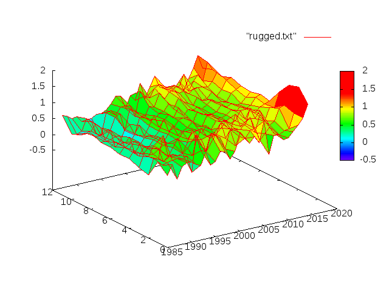
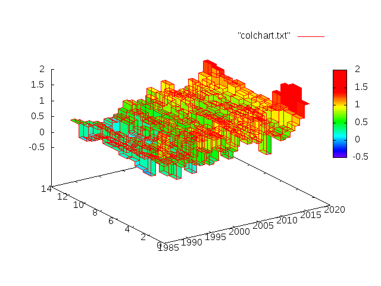

# colchart

[Drawing a pseudo 3D bar graph
in gnuplot](http://lowrank.net/gnuplot/plotpm3d-e.html#6.9)
requires preprocessing the data.
This program is the answer to the homework problem
posed by the above link.

中文： [從試算表產生柱柱圖（三次元長條圖）](https://newtoypia.blogspot.tw/2017/01/column-chart.html)。

## 1. For the Impatient ##

Usage:
```bash
    ./mat2list.pl -r '1987:' -c '1:' temperature.csv > rugged.txt
    ./pt2sq.pl rugged.txt > colchart.txt
```
Then inside gnuplot:
```gnuplot
    load "colchart.gpt"
```
to draw the column chart (3d bar chart) and
generate two png files "rugged.png" and "colchart.png".

## 2. The Sample Data ##

The sample data is the deviation of the monthly
average temperature from the average temperature
of 1951-1980 means of the corresponding month
for the North Hemisphere (land + ocean).
[It](https://data.giss.nasa.gov/gistemp/tabledata_v3/NH.Ts+dSST.csv)
is taken from NASA's [GISS Surface Temperature
Analysis](https://data.giss.nasa.gov/gistemp/).
Only rows corresponding to years 1987-2016
and columns corresponding to the 12 months are retained.

## 3. [mat2list.pl](mat2list.pl) ##

This script reads a csv file or a space-delimited tabulated
matrix of numbers (e.g. generated by a spreadsheet program)
and converts it into lines of the format:
```row_label column_label matrix_entry```.
An extra blank line is inserted
after the last entry of each row.
When fed as a data file to the "splot" command of gnuplot,
this kind of file is interpreted as x-, y-, and z-coordinates,
and the result is a (rugged) grid plot.



Usage example:
```./mat2list.pl -r '1987:' -c '1:' temperature.csv > rugged.txt```
It can also read from standard input:
```./mat2list.pl -r '1987:' -c '1:' < temperature.csv > rugged.txt```

The following command line options are available:

```-c m:n``` column labels (x-coordinates)
starts at m and increments by n for each column.

```-r m:n``` row labels (y-coordinates)
starts at m and increments by n for each row.

``` -d ':'``` input delimiter is ':' instead of ','

``` -t``` transpose the output. That is,
output lines of the format instead:
```row_label column_label matrix_entry```.

For -c and -r, the starting number is 0 if omitted,
and the step number is 1 if omitted.
Instead of a pair of colon-separated numbers,
the argument to -r or -c can also be a list of
space-separated numbers, directly specifying
the labels themselves.

## 4. [pt2sq.pl](pt2sq.pl) ##

Suppose you have a data file rugged.txt (e.g. generated by
[mat2list.pl](mat2list.pl)) consisting of lines of the format:
```x_coord y_coord z_coord```
where the x-coordinates and y-coordinates form a
rectangular grid. 

In order to create a column chart (3d version of
a normal bar chart), we need to expand the data
by converting every input line into 4 vertices
of the same height (z-coordinate) that surround
the original vertex. In general, each new vertex
should be placed at the center of 4 original
neighboring vertices.
Some original vertices (i.e. those at the border of the plot)
don't have neighbors and therefore the corresponding
new vertices' x- and y-coordinates have to be guessed.

The [pt2sq.pl](pt2sq.pl) script does this expansion by taking
the -x and -y options that specify the x-spacing and
y-spacing of the original data.
These options default to 1.0 if they are missing.
That is, **[pt2sq.pl](pt2sq.pl) does not infer the spacing
from the input data**.

Usage example:
```./pt2sq.pl rugged.txt > colchart.txt```
It can also read from standard input:
```./pt2sq.pl < rugged.txt > colchart.txt```

Then you can ```splot "colchart.txt"``` inside gnuplot
and get the column chart.



